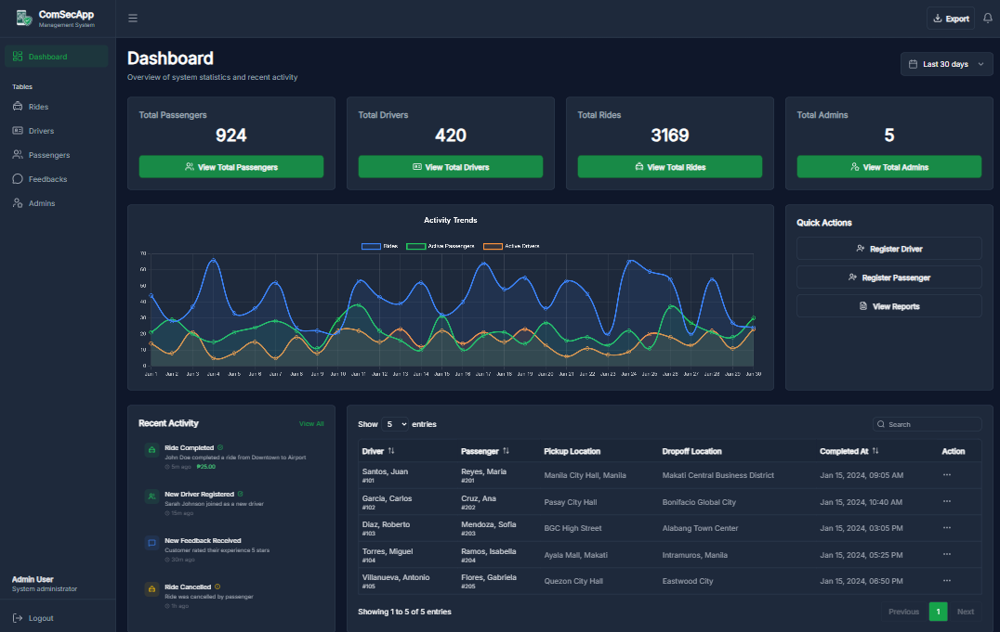

# Commuter Security Application - Admin Dashboard

A modern admin dashboard built with **Nuxt 4**, **Vue 3**, **Pinia**, and **TypeScript** for managing a commuter security platform. This application serves as the management system for the CSA mobile app, providing comprehensive statistics, user management, and ride tracking capabilities.

## 🌐 Live Demo

**[View Live Demo](https://csa-management-system.vercel.app/)**

## 📸 Screenshot



## 🏗️ System Architecture

```
┌─────────────────┐     ┌──────────────┐     ┌─────────────────┐     ┌─────────────────┐
│   Mobile App    │────▶│   Database   │◀────│  Backend API    │◀────│  Admin Panel    │
│  (Passengers &  │     │  (Ride Data) │     │  (REST API)     │     │  (This Project) │
│    Drivers)     │     └──────────────┘     └─────────────────┘     └─────────────────┘
└─────────────────┘
```

- **Mobile App** - Passengers request rides, drivers accept and complete them
- **Database** - Stores all ride data, user information, and transactions
- **Backend API** - Processes data and exposes endpoints for the admin panel
- **Admin Panel** - This project; manages users, monitors rides, and views analytics

## ✨ Features

- **Dashboard Analytics** - Real-time statistics for passengers, drivers, rides, and admins
- **User Management** - Manage passengers, drivers, and admin accounts
- **Ride Tracking** - View and monitor all rides with detailed information
- **Authentication** - Secure middleware-protected routes
- **Responsive Design** - Mobile-friendly UI with TailwindCSS
- **Type Safety** - Full TypeScript support for better development experience

## 🛠️ Tech Stack

- **Framework**: Nuxt 4
- **UI Framework**: Vue 3
- **Language**: TypeScript
- **Styling**: TailwindCSS
- **Icons**: Lucide Vue Next
- **API Client**: Custom composables with error handling

## 📁 Project Structure

```
app/
├── pages/           # Page components (dashboard, passengers, drivers, etc.)
├── composables/     # Reusable logic (useRides, useDashboard, useApi, etc.)
├── components/      # Reusable UI components
├── utils/           # Utility functions (date formatting, etc.)
├── types/           # TypeScript type definitions
└── middleware/      # Route middleware (auth, etc.)
```

## 🚀 Getting Started

### Prerequisites

- Node.js 16+
- npm, pnpm, yarn, or bun

### Installation

Install dependencies:

```bash
npm install
```

### Development Server

Start the development server on `http://localhost:3000`:

```bash
npm run dev
```

The application will be available at `http://localhost:3000` with hot module replacement enabled.

### Build for Production

Build the application for production:

```bash
npm run build
```

### Preview Production Build

Locally preview the production build:

```bash
npm run preview
```

## 🔌 API Integration

The dashboard integrates with a backend API for:

- **Dashboard Stats** - Fetches total passengers, drivers, rides, admins, and active drivers
- **Rides Data** - Retrieves ride history with pickup/dropoff locations and timestamps
- **User Management** - CRUD operations for passengers, drivers, and admins

### Example API Response (Dashboard Stats)

```json
{
  "success": true,
  "data": {
    "totalPassengers": 924,
    "totalDrivers": 420,
    "totalRides": 3169,
    "totalAdmins": 5,
    "todayRides": 169,
    "activeDrivers": 402
  }
}
```

## 🧩 Key Composables

- **useDashboard** - Manages dashboard statistics and data fetching
- **useRides** - Handles ride data retrieval and management
- **useApi** - Custom API client with error handling

## 🔐 Authentication

Routes are protected with the `auth` middleware. Ensure users are authenticated before accessing protected pages.

## 🌍 Deployment

For deployment information, check out the [Nuxt deployment documentation](https://nuxt.com/docs/getting-started/deployment).

## 📄 License

This project is part of the CSA Capstone program.
